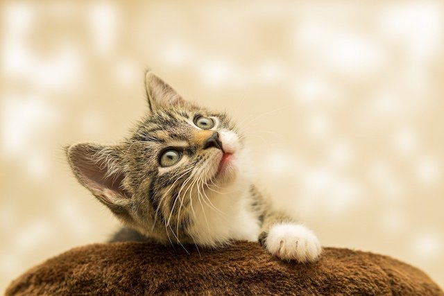
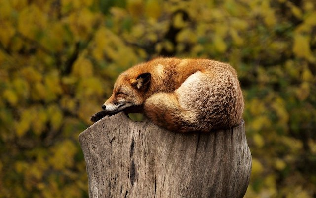
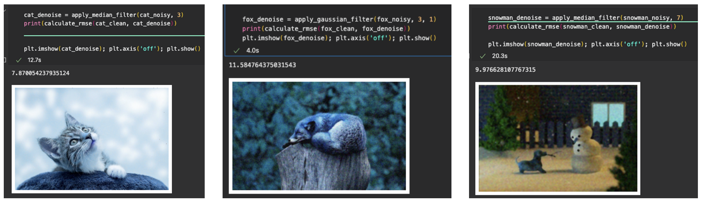
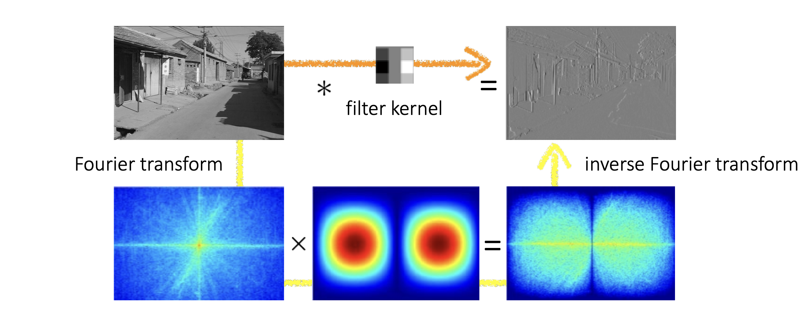
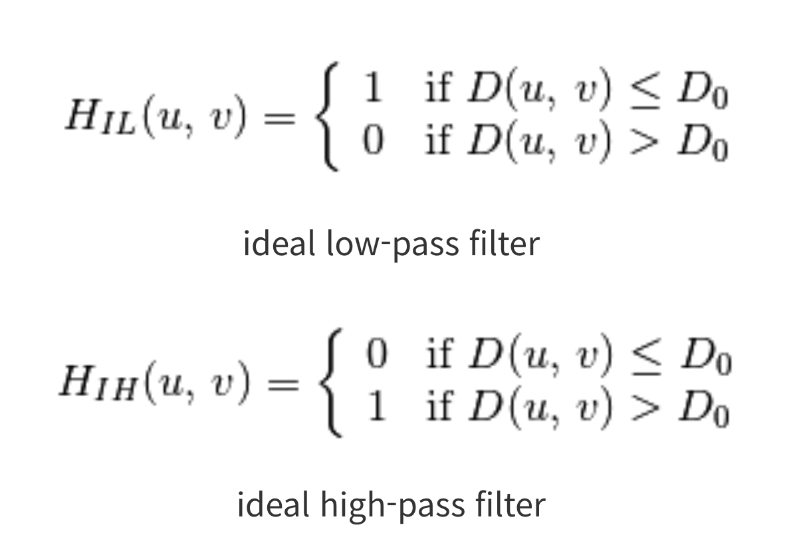
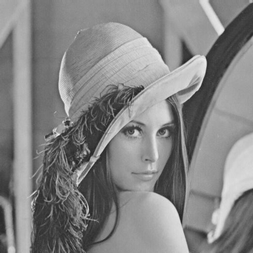
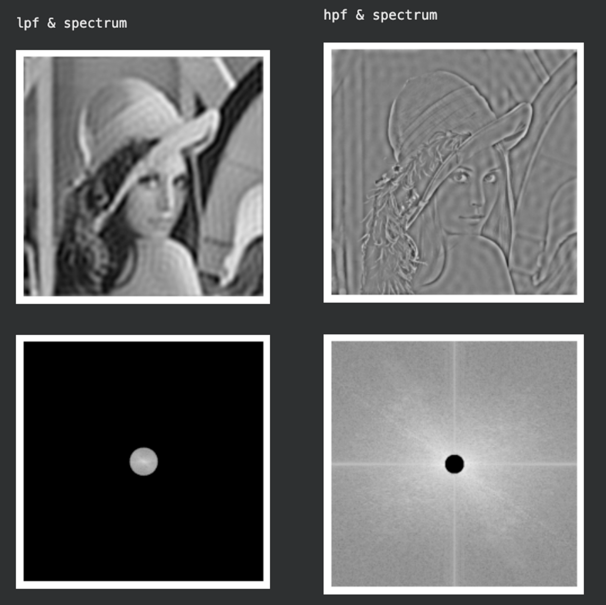
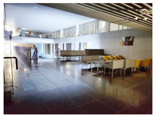

# Image-enhancer

## Overview: Image Denoising
There are many ways to denoise damaged image.  
At this project, we implement three main method to denoise image.
- Filter denoising
- Pass Filter using FFT(Fast Fourier Transform)
- Histogram equallization

### Notice: RMSE(Root Mean Square Error)
By rooting the MSE(Mean Square Error), the distortion of the value caused by squaring the error is reduced.
- The smaller the value, the more similar the two images are.

```python
def calculate_rmse(img1, img2):
    """
    Calculates RMS error between two images. Two images should have same sizes.
    """
    if (img1.shape[0] != img2.shape[0]) or \
            (img1.shape[1] != img2.shape[1]) or \
            (img1.shape[2] != img2.shape[2]):
        raise Exception("img1 and img2 should have sime sizes.")

    diff = np.abs(img1.astype(dtype=int) - img2.astype(dtype=int))
    return np.sqrt(np.mean(diff ** 2))
```

- - -

## Average Filter

Because padding occurs when avg filter is applied, the padding distance is set as the edge variable in the code.  
In the first two iterations, each row and column of the given img are traversed. Each circuit traverses the rows and columns of the kernel, stores the RGB values of each channel in the temp variable, and divides them by the kernel size (adj_val) when the kernel is complete, and stores them in the image (img_result) to be returned  

```python
def apply_average_filter(img, kernel_size):
    """
    It takes 2 arguments, 
    'img' is input image.
    'kernel_size' is size of kernel for average filter.
    """
    edge = int((kernel_size - 1) / 2)

    row_len = len(img)
    col_len = len(img[0])

    adj_value = 1 / (kernel_size ** 2)

    img_result = np.full((row_len, col_len, 3), 0)

    for row in range(edge, row_len-edge):
        for col in range(edge, col_len-edge):
            temp_0, temp_1, temp_2 = 0, 0, 0
            
            for result_row in range(row-edge, row+edge+1):
                for result_col in range(col-edge, col+edge+1):
                    temp_0 += img[result_row, result_col, 0]
                    temp_1 += img[result_row, result_col, 1]
                    temp_2 += img[result_row, result_col, 2]

            temp_0 = temp_0 * adj_value
            temp_1 = temp_1 * adj_value
            temp_2 = temp_2 * adj_value
            img_result[row, col] = [temp_0, temp_1, temp_2]

    return img_result
```

### Result: Average
<div align="center">
  
</div>

- Each pixel is reallocated to an average value by referring to the surrounding value by the kernel size. As a result, the image is blurred.


## Sobel filter

It is the same principle as the average filter, but the blue filter and the derivative column filter are specified.

```python
def apply_sobel_filter(img, kernel_size, is_vertical):
    """
    It takes 3 arguments,
    'img' is input image.
    'kernel_size' is size of kernel for sobel filter.
    'is_vertical' is boolean value. If it is True, you should apply vertical sobel filter.
    Otherwise, you should apply horizontal sobel filter.
    """

    # sobel kernel setting
    sobel_kernel = np.full((kernel_size, kernel_size), 0)
    blur, derivative = [], []


    if kernel_size == 3:
        blur = [1, 2, 1]
        derivative = [-1, 0, 1]
    elif kernel_size == 5:
        blur = [1, 4, 6 ,4 ,1]
        derivative = [-1, -2, 0, 2, 1]
    elif kernel_size == 7:
        blur = [1, 6, 15, 20, 15, 6, 1]
        derivative = [-1, -4, -5, 0, 5, 4, 1]


    for row in range(kernel_size):
        for col in range(kernel_size):
            ver_val = blur[row] * derivative[col]
            hor_val = derivative[row] * blur[col]

            if is_vertical:
                sobel_kernel[row][col] = ver_val 
            else:
                sobel_kernel[row][col] = hor_val

    # result setting
    edge = int((kernel_size - 1) / 2)

    row_len = len(img)
    col_len = len(img[0])

    img_result = np.full((row_len, col_len, 1), 0)

    for row in range(edge, row_len-edge):
        for col in range(edge, col_len-edge):
            temp = 0

            for result_row in range(row-edge, row+edge+1):
                for result_col in range(col-edge, col+edge+1):
                    # 0 ~ kernel_size
                    kernel_row = result_row - (row-edge)
                    kernel_col = result_col - (col-edge)

                    img_value = img[result_row, result_col, 0]
                    sobel_value = sobel_kernel[kernel_row][kernel_col]
                    temp += img_value * sobel_value

            img_result[row, col, 0] = np.clip(temp, 0, 255)

    return img_result
```

### Result: Sobel

<div align="center">
  
</div>

- The Sobel filter applies differentiation in the vertical and horizontal directions, and visualizes by allocating darker values with negative changes and brighter values with positive changes. Consequently, it is advantageous for edge detection.


## Median filter
```python
def apply_median_filter(img, kernel_size):
    edge = int((kernel_size - 1) / 2)

    row_len = len(img)
    col_len = len(img[0])

    img_result = np.full((row_len, col_len, 3), 0)

    for row in range(row_len):
        for col in range(col_len):
            temp_0, temp_1, temp_2 = [], [], []

            for result_row in range(row-edge, row+edge+1):
                for result_col in range(col-edge, col+edge+1):
                    try:
                        temp_0.append(img[result_row, result_col, 0])
                    except:
                        pass
                    try:
                        temp_1.append(img[result_row, result_col, 1])
                    except:
                        pass
                    try:
                        temp_2.append(img[result_row, result_col, 2])
                    except:
                        pass

            color_0, color_1, color_2 = np.median(
                temp_0), np.median(temp_1), np.median(temp_2)
            img_result[row, col] = [color_0, color_1, color_2]

    return img_result
```

## Gaussian filter
```python
def apply_gaussian_filter(img, k_size=3, sigma=1):
    rows, cols, channels = img.shape

    # Check the source code for more information about gaussian_kernel
    gaussian_filter = gaussian_kernel(k_size, sigma)

    pad_img = padding(img, k_size)
    filtered_img = np.zeros((rows, cols, channels), dtype=np.float32)

    for ch in range(0, channels):
        for i in range(rows):
            for j in range(cols):
                filtered_img[i, j, ch] = np.sum(
                    gaussian_filter * pad_img[i:i+k_size, j:j+k_size, ch])

    return filtered_img.astype(np.uint8)
```

## Test images
**Clean**
<div align="center">
  <figure class="third"> 
    
    
    
    
    
    </figure>
</div>

**Noisy**
<div align="center">
  <figure class="third"> 
    
    
    
    
    
    </figure>
</div>

## Results

<div align="center">
  
</div>

- cat(median, 3) → 7.87(RMSE) : Advanced
- fox(gaussian, 3, 1) → 11.58(RMSE) : Basic
- snowman(median, 7) → 9.76(RMSE) : Advanced

### Why Median and Gaussian?
The given cat and snowman noise images are representative cases of **salt and pepper**. It was determined that a median filter would be suitable when extreme pixel values alternately appear, such as in the Salt and pepper image.
 
On the other hand, in the case of the original fox image, the background is **blurred** because it is focused on foxes and trees. Therefore, if the image with noise is slightly blurred, it would be similar to the original image, so we chose a Gaussian filter that blur the image.

- - -

## Fourier Transform

### Why using FFT?

**Spatial domain filtering**
<div align="center">
  
</div>

Using the FFT technique, it is possible to move an image of a spatial domain to the frequency domain. Then, large-scale patterns within the original image correspond to low frequencies, and small-scale noise-like patterns correspond to high frequencies. In other words, the frequency domain can be divided into low-frequency and high-frequency parts, and processing such high-frequency parts as removal or attenuation and then inverse transforming them back to the spatial domain is a typical processing method of FFT-based noise removal.

Also FFT can reduce time and computational complexity when compared to kernel filtering.

**fftshift & ifftshift**
```python
def fftshift(img):
    '''
    This function should shift the spectrum image to the center.
    You should not use any kind of built in shift function. Please implement your own.
    '''
    row_len, col_len = img.shape
    fft_shifted = np.roll(img, (row_len//2, col_len//2), axis=(0, 1))

    return fft_shifted


def ifftshift(img):
    '''
    This function should do the reverse of what fftshift function does.
    You should not use any kind of built in shift function. Please implement your own.
    '''
    row_len, col_len = np.shape(img)
    fft_unshifted = np.roll(img, (-row_len//2, -col_len//2), axis=(0, 1))

    return fft_unshifted

```

### Low/High pass filter

<div align="center">
  
</div>

- Image preprocessing with fft, ftshift
- lpf: 0 elements not included in the reference distance (r) relative to the image center
- hpf: 0 elements included in the reference distance (r) relative to the image center
- Return the image by post-processing iftshift, ifft in the reverse order of preprocessing


```python
def low_pass_filter(img, r=30):
    '''
    This function should return an image that goes through low-pass filter.
    '''
    fft_img = np.fft.fft2(img)
    fftshift_img = fftshift(fft_img)

    row_len, col_len = fftshift_img.shape
    row_center, col_center = int(row_len/2), int(col_len/2)

    result_fft_img = fftshift_img.copy()

    for row in range(row_len):
        for col in range(col_len):
            edge_radius = np.sqrt((row_center-row)**2 + (col_center-col)**2)

            if edge_radius > r:
                result_fft_img[row, col] = 0

    ifft_img = ifftshift(result_fft_img)
    result_img = np.fft.ifft2(ifft_img).real

    return result_img


def high_pass_filter(img, r=20):
    '''
    This function should return an image that goes through high-pass filter.
    '''
    fft_img = np.fft.fft2(img)
    fftshift_img = fftshift(fft_img)

    row_len, col_len = fftshift_img.shape
    row_center, col_center = int(row_len/2), int(col_len/2)

    result_fft_img = fftshift_img.copy()

    for row in range(row_len):
        for col in range(col_len):
            edge_radius = np.sqrt((row_center-row)**2 + (col_center-col)**2)

            if edge_radius < r:
                result_fft_img[row, col] = 0

    ifft_img = ifftshift(result_fft_img)
    result_img = np.fft.ifft2(ifft_img).real

    return result_img
```
## Test image
**Lena_clean**
<div align="center">
  
</div>

### Result
<div align="center">
  
</div>

- LPF: image of dull edge and blurred by removing high frequency part  
- HPF: edge-oriented image by removing low frequency part

- - - 

## Histogram equallization
Histogram equalization uses a low contrast input image with a narrow range of pixel values to obtain a high contrast output image with a wide range of pixel values. In other words, because the brightness values are concentrated, a clearer image is obtained by smoothing a dim or bright image.

```python
hist, bins = np.histogram(img.ravel(), 256, [0, 256])
hist_sum = hist.cumsum()

# except 0 by mask
hist_m0 = np.ma.masked_equal(hist_sum, 0)

# equallization
hist_m0 = (hist_m0 - hist_m0.min()) * 255 / (hist_m0.max() - hist_m0.min())

# restore 0 from mask excepted
hist_sum = np.ma.filled(hist_m0, 0).astype('uint8')

result_img = hist_sum[img]

return result_img
```

- stretch histogram using below equation
> (hist_m0- hist_m0.min())*255/(hist_m0.max()- hist_m0.min())

## Test image & Result

<div align="center">
  <figure class="third"> 
    
    
    
    </figure>
</div>

- The histogram of the dark image was concentrated on the left and the bright image on the right, so if you spread this distribution widely, you will get an image of moderate brightness.


- - -

## Libraries
- [OpenCV](https://opencv.org/)
- [Numpy](https://numpy.org/)


## References
Some images are from [SeonJoo Kim](https://sites.google.com/site/seonjookim/), Yonsei University

### Environment
OS: Mac Ventura  
Language: Python(3.9.12)