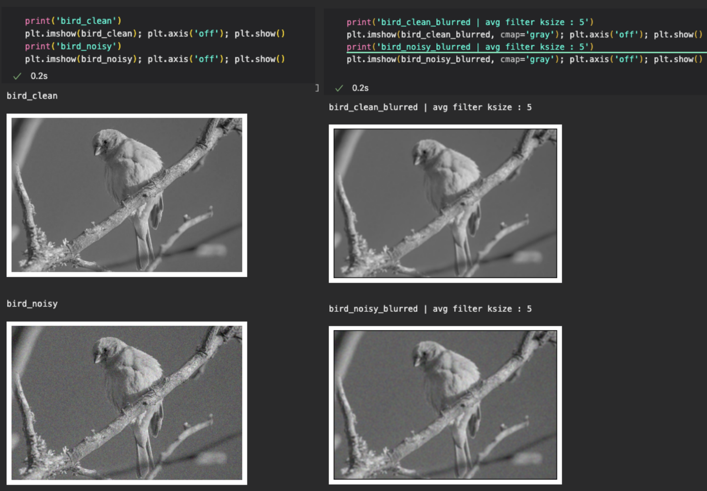
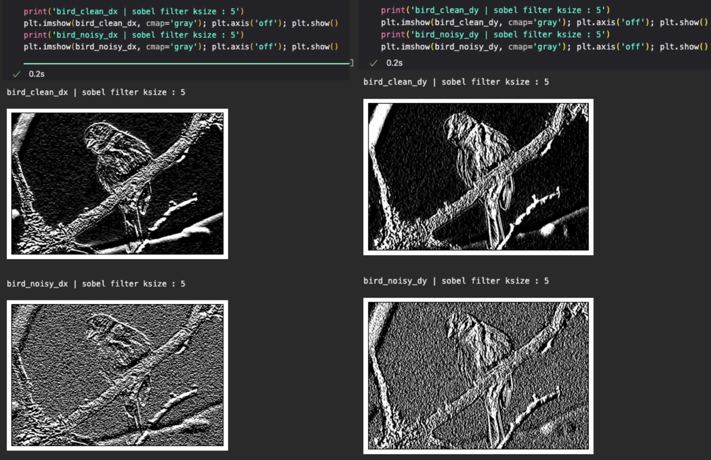
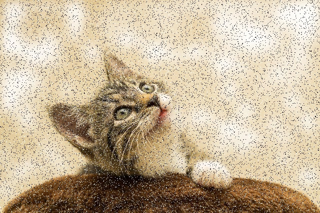
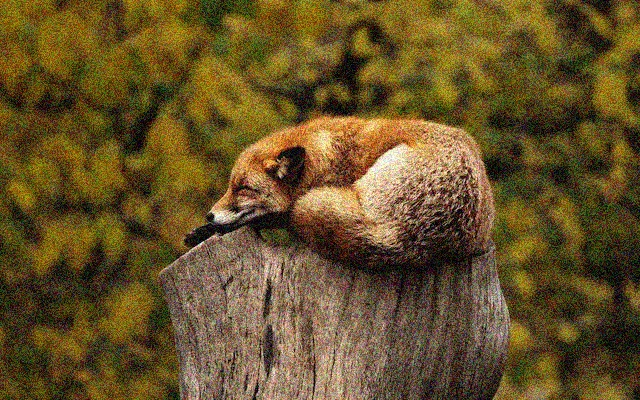
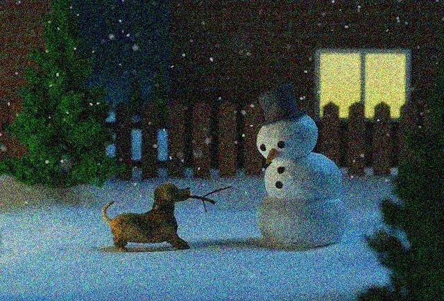

# Image-enhancer

## Image Denoising

### RMSE(Root Mean Square Error)
By rooting the MSE(Mean Square Error), the distortion of the value caused by squaring the error is reduced.
- The smaller the value, the more similar the two images are.

```python
def calculate_rmse(img1, img2):
    """
    Calculates RMS error between two images. Two images should have same sizes.
    """
    if (img1.shape[0] != img2.shape[0]) or \
            (img1.shape[1] != img2.shape[1]) or \
            (img1.shape[2] != img2.shape[2]):
        raise Exception("img1 and img2 should have sime sizes.")

    diff = np.abs(img1.astype(dtype=int) - img2.astype(dtype=int))
    return np.sqrt(np.mean(diff ** 2))
```

### Average Filter

Because padding occurs when avg filter is applied, the padding distance is set as the edge variable in the code.  
In the first two iterations, each row and column of the given img are traversed. Each circuit traverses the rows and columns of the kernel, stores the RGB values of each channel in the temp variable, and divides them by the kernel size (adj_val) when the kernel is complete, and stores them in the image (img_result) to be returned  

```python
def apply_average_filter(img, kernel_size):
    """
    It takes 2 arguments, 
    'img' is input image.
    'kernel_size' is size of kernel for average filter.
    """
    edge = int((kernel_size - 1) / 2)

    row_len = len(img)
    col_len = len(img[0])

    adj_value = 1 / (kernel_size ** 2)

    img_result = np.full((row_len, col_len, 3), 0)

    # if kernel_size == 1:
    #     return img

    for row in range(edge, row_len-edge):
        for col in range(edge, col_len-edge):
            temp_0, temp_1, temp_2 = 0, 0, 0
            
            for result_row in range(row-edge, row+edge+1):
                for result_col in range(col-edge, col+edge+1):
                    temp_0 += img[result_row, result_col, 0]
                    temp_1 += img[result_row, result_col, 1]
                    temp_2 += img[result_row, result_col, 2]

            temp_0, temp_1, temp_2 = temp_0 * adj_value, temp_1 * adj_value, temp_2 * adj_value
            img_result[row, col] = [temp_0, temp_1, temp_2]

    return img_result
```

<div align="center">
  
</div>

- Each pixel is reallocated to an average value by referring to the surrounding value by the kernel size. As a result, the image is blurred.


### Sobel filter

It is the same principle as the average filter, but the blue filter and the derivative column filter are specified.

```python
def apply_sobel_filter(img, kernel_size, is_vertical):
    """
    It takes 3 arguments,
    'img' is input image.
    'kernel_size' is size of kernel for sobel filter.
    'is_vertical' is boolean value. If it is True, you should apply vertical sobel filter.
    Otherwise, you should apply horizontal sobel filter.
    """

    # sobel kernel setting
    sobel_kernel = np.full((kernel_size, kernel_size), 0)
    blur, derivative = [], []


    if kernel_size == 3:
        blur = [1, 2, 1]
        derivative = [-1, 0, 1]
    elif kernel_size == 5:
        blur = [1, 4, 6 ,4 ,1]
        derivative = [-1, -2, 0, 2, 1]
    elif kernel_size == 7:
        blur = [1, 6, 15, 20, 15, 6, 1]
        derivative = [-1, -4, -5, 0, 5, 4, 1]


    for row in range(kernel_size):
        for col in range(kernel_size):
            ver_val = blur[row] * derivative[col]
            hor_val = derivative[row] * blur[col]

            sobel_kernel[row][col] = ver_val if is_vertical == True else hor_val

    # result setting
    edge = int((kernel_size - 1) / 2)

    row_len = len(img)
    col_len = len(img[0])

    img_result = np.full((row_len, col_len, 1), 0)

    for row in range(edge, row_len-edge):
        for col in range(edge, col_len-edge):
            temp = 0

            for result_row in range(row-edge, row+edge+1):
                for result_col in range(col-edge, col+edge+1):
                    # 0 ~ kernel_size
                    kernel_row = result_row - (row-edge)
                    kernel_col = result_col - (col-edge)

                    temp += img[result_row, result_col, 0] * sobel_kernel[kernel_row][kernel_col]

            img_result[row, col, 0] = np.clip(temp, 0, 255)

    return img_result
```

<div align="center">
  
</div>

- The Sobel filter applies differentiation in the vertical and horizontal directions, and visualizes by allocating darker values with negative changes and brighter values with positive changes. Consequently, it is advantageous for edge detection.


### Median filter


```python
def apply_median_filter(img, kernel_size):
    edge = int((kernel_size - 1) / 2)

    row_len = len(img)
    col_len = len(img[0])

    img_result = np.full((row_len, col_len, 3), 0)

    for row in range(row_len):
        for col in range(col_len):
            temp_0, temp_1, temp_2 = [], [], []

            for result_row in range(row-edge, row+edge+1):
                for result_col in range(col-edge, col+edge+1):
                    try:
                        temp_0.append(img[result_row, result_col, 0])
                    except:
                        pass
                    try:
                        temp_1.append(img[result_row, result_col, 1])
                    except:
                        pass
                    try:
                        temp_2.append(img[result_row, result_col, 2])
                    except:
                        pass

            color_0, color_1, color_2 = np.median(
                temp_0), np.median(temp_1), np.median(temp_2)
            img_result[row, col] = [color_0, color_1, color_2]

    return img_result
```

### Gaussian filter
```python
```

## Noisy test images


<div align="center">
  <figure class="third"> 
    
    
    
    </figure>
</div>

## Fourier Transform

### Low pass filter

### High pass filter

## Image enhancement